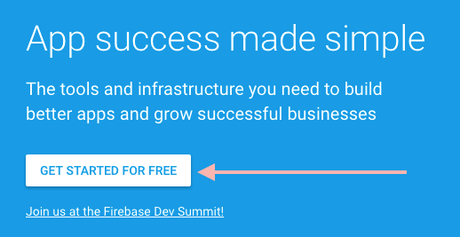
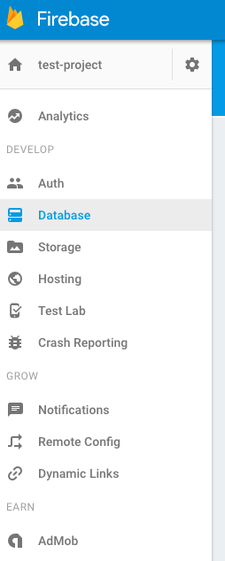
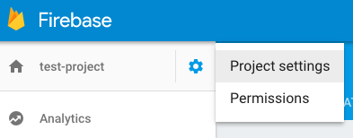
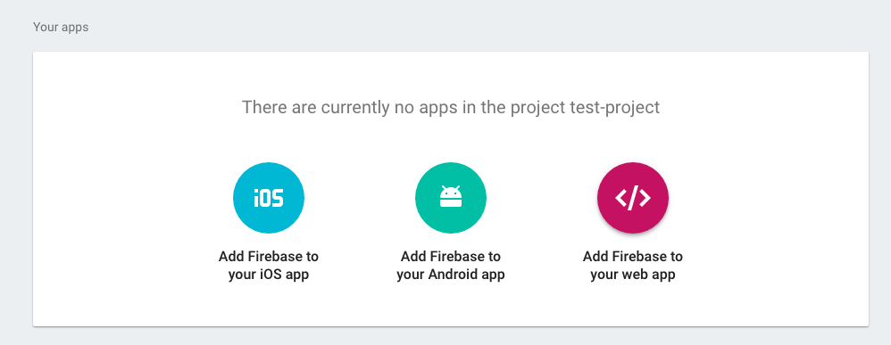
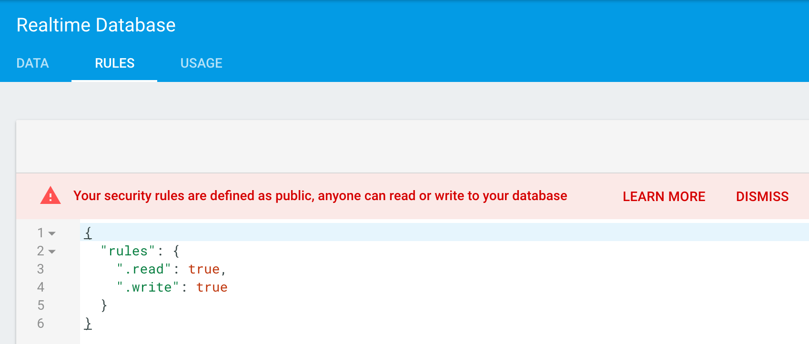

# Module 12: Introduction to Firebase

## Overview
Firebase is a _cloud hosted data service_ that we will use to store data for our web applications. Rather than write our own server-side scripts, we can leverage the firebase platform to manage our data. As a _real time_ database, Firebase will enable us to create interactive applications where users create, read, and share data (such as chat-rooms or multiplayer games).

<!-- START doctoc generated TOC please keep comment here to allow auto update -->
<!-- DON'T EDIT THIS SECTION, INSTEAD RE-RUN doctoc TO UPDATE -->

**Contents**

- [Resources](#resources)
- [Set-up](#set-up)
- [Data Structure](#data-structure)
- [Database Interactions](#database-interactions)
  - [Creating Data](#creating-data)
  - [Reading Data](#reading-data)
  - [Updating Data](#updating-data)
- [Firebase Storage](#firebase-storage)

<!-- END doctoc generated TOC please keep comment here to allow auto update -->

## Resources
- [Firebase Homepage](https://firebase.google.com/)
- [Getting Started](https://firebase.google.com/docs/web/setup)
- [Firebase Data Structure](https://firebase.google.com/docs/database/web/structure-data)
https://www.firebase.com/docs/android/guide/structuring-data.html
- [Reading and Writing to a Database](https://firebase.google.com/docs/database/web/read-and-write)
- [Create a Firebase Storage Reference](https://firebase.google.com/docs/storage/web/create-reference)

## Set-up
There are a few steps you'll need to take in order to get started using Firebase (more info [here](https://firebase.google.com/docs/web/setup)).

### On Firebase

First, you'll need to _Get Started_ by signing up for an account. Because Firebase is _owned by Google_, you'll be prompted to sign-in with (or create) a google account when you click here:



Once you've signed into your account, you'll want to navigate to your **console** where you can create a project:


From your console, you can click the _Create New Project_ button, which will prompt you to create a project, which you should give a short and descriptive name:


Once you've created a project, you can click on your project card to be navigated to your project interface at https://console.firebase.google.com/project/PROJECT-URL/overview. You can then navigate using the tab on the left to interact with specific parts of your project, such as the database:



### In Your App
Once you've set up a project your account, you'll need to link your web page to the Firebase project. This can be done in a few simple steps:

First, you'll need to load the Firebase library in the `<head>` section of your HTML file:


```html
<script src="https://www.gstatic.com/firebasejs/3.4.0/firebase.js"></script>
```

Then, in your JavaScript file, you should initialize your project:

```javascript
// Configuration: replace <THESE_VALUES> with your values from firebase
var config = {
    apiKey: "<API_KEY>",
    authDomain: "<PROJECT_ID>.firebaseapp.com",
    databaseURL: "https://<DATABASE_NAME>.firebaseio.com",
    storageBucket: "<BUCKET>.appspot.com",
};

// Initialize Firebase, providing you read/write access to the database
firebase.initializeApp(config);
```
To get the values for the `config` variable above, navigate to the _settings_ of your project from the Firebase menu:



From this location, you should click on _Add Firebase to your web app_ to access the `config` options for your project:



In order to read and write data to your database, you'll either need to authenticate your users (more on this in the next learning module), or change your **database rules**. To enable read/write access by _anyone_ (not necessarily suggested from a security standpoint), you'll need to navigate to the database/rules tab and enter the following code:

```javascript
{
"rules": {
  ".read": true,
  ".write": true
}
}

```

When you do this and click **Publish**, your should see the following screen:



You will now (finally) have access to your firebase database from your web application.

## Data Structure
In order to properly use Firebase as a data storage service, it's crucial to understand _how_ that data is structured. **All** of the data for a project is stored in the same JSON (JavaScript Object Notation) object. In other words, all of the data is stored in a single object (just as you would store information in an object in JavaScript). For example, if you had a simple to do list applicaiton, the data could be stored as follows:


```javascript
// All data is stored in the same object
{
    "todos":{
        "one":{
            "description": "Do INFO 343 Homework",
            "status":"Incomplete",
            "urgency":"Low"
        },
        "two":{
            "description": "Do INFO 474 Homework",
            "status":"Incomplete",
            "urgency":"High"
        }
    }
}
```

Data from your tree is accessed just like referencing information from an Object: using it's **key**. Object keys can be specified from your JavaScript file, or will be assigned automatically in Firebase. While we won't encounter any _huge_ data in this class, it's important to understand [best practices](https://firebase.google.com/docs/database/web/structure-data) for storing data, such as limiting the amount of nesting you do in your JSON Tree.

## Database Interactions
Now that we know how to set up a project on Firebase, connect to it in our JavaScript file, and have an understanding of the data structure, we can begin interacting with our data (JSON object). Because you'll often start off with an empty project, we'll begin by discussing how to _create_ data on Firebase.

### Creating a Database Reference
In order to perform any data action to our database, we'll first have to create a _reference_ to that data. A reference can point to the entire data structure, or a specific point in the JSON tree. For example, to point to the entire data structure, you can use the `firebase.ref` method:


```javascript
// Initialize Firebase, providing you read/write access to the database
firebase.initializeApp(config);

// Create a reference to the root of database
firebase.database().ref();

```

Firebase is intelligent enough to create _new_ child elements on the tree when you reference them for the first time:

```javascript
// Create a reference to a new child called "todos"
var todos = firebase.database().ref('todos');
```


### Creating Data
Once you have created a reference, you'll be able to store data in your database. The method for creating your elements will depend on your data structure, but let's imagine that our `todos` reference is supposed to have _multiple child elements_, each with key/value pairs explaining an item on a to-do list. To add a new item, you can specify the `push` method:

```javascript
// Create a reference to a new child called "todos"
var todos = firebase.database().ref('todos');

// Write a new item
// Push something into todos
todos.push({
    description: 'Write learning modules',
    urgency: 'High',
    status: 'incomplete'
});
```

As soon as you execute that code, an child element will be added to the `todos` reference (which is a child of the _root_ element):


### Reading Data

### Updating Data

## Firebase Storage
